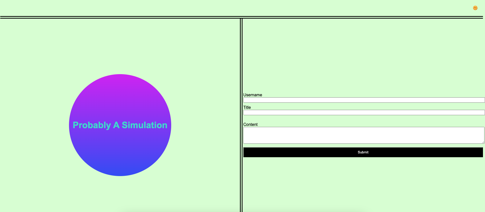
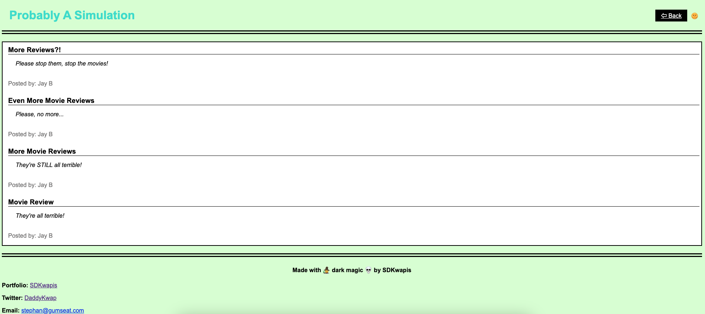

# ProbablyASimulation

A personal blog for your entertainment.

## Usage

In the avaialble text entry fields enter your username (you can just make one up), a title for the blog post, and the blog post content. When you are done filling out the form click the 'submit' button and you will be redirected to the blog page where you're most recent blog post is displayed above all previous blog posts. All posts are stored in Local Storage so erasing this will delete the blogs history. Click the sun emoji in the upper right hand corner to sdwitch between light mode and dark mode. 

## Acknowledgements

Assistance in creating this site and its function's was made possible primarily through Jung, W3 Schools, and many Stack Overflow threads.

## Visuals

## Contributing

Pull requests are welcome. For major changes, please open an issue first
to discuss what you would like to change.

Please make sure to update tests as appropriate.
